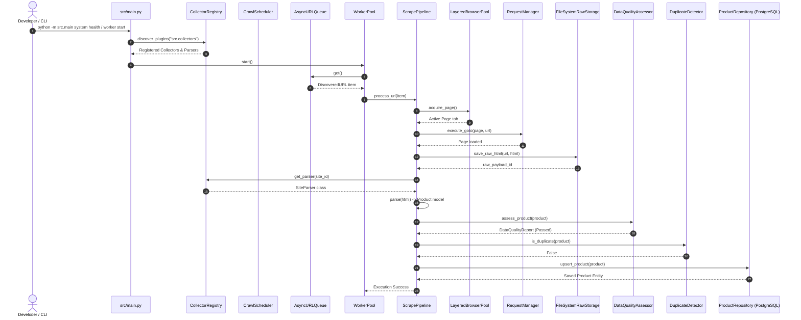

# Phase 1 Guide: Architecture & Platform Foundation

This document provides a comprehensive technical guide to the foundational architecture and platform framework implemented for the AI Shopping Copilot Distributed Web Scraping Platform.

---

# 1. Phase Overview

### What Was Implemented
In this initial phase, we built the entire foundational framework and infrastructure required to run a scalable, multi-collector distributed web scraping platform. 

The implementation includes:
1. **Packaging & Containerization**: `pyproject.toml` (`uv`), multi-stage `Dockerfile` (Python 3.12 with Playwright Chromium), `docker-compose.yml` (PostgreSQL 16), `.env.example`, and `.pre-commit-config.yaml`.
2. **Core Observability & Utilities**: Custom exception tree, `structlog` structured logging with async correlation ID binding (`trace_id`, `run_id`, `task_id`), OpenTelemetry span tracing, and Prometheus operational metrics exporters.
3. **Request Manager**: Token-bucket rate limiting, exponential backoff retries with random jitter, timeouts, random delays, and User-Agent header rotation.
4. **Domain Layer**: Pydantic v2 domain entities (`Product`, `LaptopSpecs`, `MobileSpecs`, `PriceHistory`, `ProductFingerprint`, `DiscoveredURL`, `DataQualityReport`, `CrawlJob`, `CrawlSchedule`) and domain enums (`CategoryEnum`, `CrawlTypeEnum`, `PriorityEnum`, `URLStatusEnum`, `CrawlStatusEnum`).
5. **Base Interfaces & Vector Abstractions**: `BaseCollector`, `BaseParser`, `BaseRepository`, `RawHTMLStorageInterface`, `VectorStorageInterface`, and `EmbeddingServiceInterface`.
6. **Configuration System**: Pydantic `BaseSettings` reading `.env` and PyYAML loader for system defaults and site-specific collector configs.
7. **Infrastructure Layer**: 3-Tier Layered Playwright Resource Pool (`BrowserPool` → `ContextPool` → `PagePool`), SQLAlchemy 2.0 async database engine, ORM mapped models (`ProductORM`, `DiscoveredURLORM`, `CrawlJobORM`, `CrawlScheduleORM`, `RawPayloadORM`), async repositories (`ProductRepository`, `DiscoveredURLRepository`, `CrawlRepository`), and content-hash addressable `FileSystemRawStorage`.
8. **Scraping Engine & Pipeline**: `DataQualityAssessor`, `CollectorRegistry` (with `importlib`/`pkgutil` dynamic plugin auto-discovery), `AsyncURLQueue`, `WorkerPool`, `DuplicateDetector`, and the 8-Stage `ScrapePipeline`.
9. **Crawl Scheduler**: `CrawlScheduler` and `JobManager` supporting MANUAL, SCHEDULED, DAILY, WEEKLY, INCREMENTAL, and FULL crawl modes with priority queues and state checkpoint resumption.
10. **CLI & Unit Testing**: Rich Typer CLI (`src/cli/main.py`) with command groups (`db`, `collector`, `worker`, `system`) and pytest suite.

### Why Built First
Establishing these components first ensures strict Clean Architecture boundaries and SOLID principles before any specific site collectors (e.g. Amazon, BestBuy) are added. By decoupling site collection logic from infrastructure, database persistence, rate limiting, and observability, future site collectors can be dropped in as independent plugins without modifying platform core logic.

### Architectural Fit
This foundational framework serves as the engine runtime:
- **CLI / Scheduler** triggers crawl jobs.
- **Queue / Worker Pool** consumes targets.
- **Request Manager & Layered Browser Pool** fetch raw pages securely.
- **Pipeline** parses, validates, assesses quality, deduplicates, and persists normalized product data to PostgreSQL.

---

# 2. Folder Structure

```
ai_shopping_assistant/
├── pyproject.toml
├── Dockerfile
├── docker-compose.yml
├── .env.example
├── .pre-commit-config.yaml
├── alembic.ini
├── alembic/
│   ├── env.py
│   ├── script.py.mako
│   └── versions/
├── config/
│   ├── default.yaml
│   └── collectors/
├── docs/
│   └── PHASE_01_GUIDE.md
├── src/
│   ├── __init__.py
│   ├── main.py
│   ├── cli/
│   │   ├── __init__.py
│   │   └── main.py
│   ├── config/
│   │   ├── __init__.py
│   │   ├── settings.py
│   │   └── loader.py
│   ├── core/
│   │   ├── __init__.py
│   │   ├── exceptions.py
│   │   ├── logging.py
│   │   ├── telemetry.py
│   │   ├── metrics.py
│   │   └── request_manager.py
│   ├── domain/
│   │   ├── __init__.py
│   │   ├── enums.py
│   │   └── models/
│   │       ├── __init__.py
│   │       ├── product.py
│   │       ├── specs.py
│   │       ├── url.py
│   │       ├── quality.py
│   │       └── crawl.py
│   ├── interfaces/
│   │   ├── __init__.py
│   │   ├── collector.py
│   │   ├── parser.py
│   │   ├── repository.py
│   │   ├── raw_storage.py
│   │   └── vector.py
│   ├── infrastructure/
│   │   ├── __init__.py
│   │   ├── browser/
│   │   │   ├── __init__.py
│   │   │   └── browser_pool.py
│   │   ├── db/
│   │   │   ├── __init__.py
│   │   │   ├── base.py
│   │   │   ├── session.py
│   │   │   ├── models/
│   │   │   └── repositories/
│   │   └── storage/
│   │       ├── __init__.py
│   │       └── raw_storage.py
│   ├── quality/
│   │   ├── __init__.py
│   │   └── assessor.py
│   ├── scheduler/
│   │   ├── __init__.py
│   │   ├── job_manager.py
│   │   └── scheduler.py
│   ├── collectors/
│   │   └── __init__.py
│   └── engine/
│       ├── __init__.py
│       ├── registry.py
│       ├── queue.py
│       ├── worker.py
│       ├── deduplication.py
│       └── pipeline.py
└── tests/
    ├── __init__.py
    ├── conftest.py
    └── unit/
```

### Directory Details

#### `config/`
- **Why it exists**: Stores YAML configurations for system defaults and site-specific overrides.
- **What belongs inside**: `default.yaml` and site YAML files in `config/collectors/*.yaml`.
- **What should not belong inside**: Python code or raw data payloads.

#### `alembic/`
- **Why it exists**: Manages database migrations for SQLAlchemy ORM models.
- **What belongs inside**: `env.py`, `script.py.mako`, and generated version scripts in `versions/`.

#### `src/cli/`
- **Why it exists**: Contains Typer CLI commands for managing the platform.
- **What belongs inside**: Command definitions (`db`, `collector`, `worker`, `system`).

#### `src/config/`
- **Why it exists**: Houses environment settings and YAML loaders.
- **What belongs inside**: `settings.py` (Pydantic BaseSettings) and `loader.py`.

#### `src/core/`
- **Why it exists**: Houses foundational cross-cutting utilities (logging, metrics, tracing, request manager, exceptions).
- **What belongs inside**: Core infrastructure utilities without domain logic dependencies.

#### `src/domain/`
- **Why it exists**: Contains core business entities, enums, and specification schemas.
- **What belongs inside**: Pure domain models (`Product`, `LaptopSpecs`, `DiscoveredURL`, etc.).
- **What should not belong inside**: Database queries, Playwright calls, or web scraping logic.

#### `src/interfaces/`
- **Why it exists**: Defines Abstract Base Classes (ABCs) and protocols enforcing contracts across layers.
- **What belongs inside**: Interfaces (`BaseCollector`, `BaseParser`, `BaseRepository`, `RawHTMLStorageInterface`).

#### `src/infrastructure/`
- **Why it exists**: Implements external system integrations (Playwright browser pool, PostgreSQL database, File system raw storage).
- **What belongs inside**: SQLAlchemy ORM models, async repository implementations, browser pool.

#### `src/quality/`
- **Why it exists**: Implements Data Quality Assessment rules.
- **What belongs inside**: `DataQualityAssessor`.

#### `src/scheduler/`
- **Why it exists**: Manages crawl schedules, execution jobs, and interrupted job checkpoints.
- **What belongs inside**: `CrawlScheduler` and `JobManager`.

#### `src/collectors/`
- **Why it exists**: Root package where concrete website collectors and parsers will reside.
- **What belongs inside**: Site collector module plugins automatically discovered by `CollectorRegistry`.

#### `src/engine/`
- **Why it exists**: Core execution engine managing queues, workers, deduplication, plugin registry, and scraping pipeline.

---

### File Responsibility & Usage Table

| File | Purpose / Responsibility | Used By |
| :--- | :--- | :--- |
| `pyproject.toml` | `uv` package dependencies, Ruff, MyPy, Pytest config | `uv`, Build tools, CI |
| `Dockerfile` | Multi-stage production container setup | Docker, Docker Compose |
| `docker-compose.yml` | PostgreSQL container persistence setup | Docker Compose |
| `.env.example` | Environment variables template | Developer setup |
| `src/main.py` | Entrypoint delegating to CLI app | Terminal runtime |
| `src/cli/main.py` | Typer CLI command application | CLI commands |
| `src/core/exceptions.py` | Exception hierarchy | All modules |
| `src/core/logging.py` | Structured JSON logging & context binding | All modules |
| `src/core/telemetry.py` | OpenTelemetry tracing setup | Pipeline, worker |
| `src/core/metrics.py` | Prometheus operational metrics | Pipeline, worker, CLI |
| `src/core/request_manager.py` | Rate limiter, retries with jitter, UA rotation | Collectors, Pipeline |
| `src/domain/enums.py` | Domain enumerations | Models, Repositories |
| `src/domain/models/product.py` | Product, PriceHistory, ProductFingerprint models | Pipeline, Repositories |
| `src/domain/models/specs.py` | LaptopSpecs, MobileSpecs models | Product model, Parsers |
| `src/domain/models/url.py` | DiscoveredURL queue model | Queue, Repositories |
| `src/domain/models/quality.py` | DataQualityReport model | Quality Assessor |
| `src/domain/models/crawl.py` | CrawlJob, CrawlSchedule models | Scheduler, JobManager |
| `src/interfaces/collector.py` | BaseCollector ABC contract | Site collectors |
| `src/interfaces/parser.py` | BaseParser ABC contract | Site parsers |
| `src/interfaces/repository.py` | Async repository contracts | Repositories, Pipeline |
| `src/interfaces/raw_storage.py` | Raw HTML storage interface | Raw storage, Pipeline |
| `src/interfaces/vector.py` | Vector storage interfaces | Future vector DB |
| `src/infrastructure/browser/browser_pool.py` | 3-Tier Playwright resource pool | Pipeline, Collectors |
| `src/infrastructure/db/session.py` | SQLAlchemy AsyncEngine & Session factory | Repositories, CLI |
| `src/infrastructure/db/base.py` | DeclarativeBase & TimestampMixin | ORM Models |
| `src/infrastructure/db/models/product.py` | ProductORM, SpecORM, PriceHistoryORM | Repositories |
| `src/infrastructure/db/models/url.py` | DiscoveredURLORM | URL Repository |
| `src/infrastructure/db/models/crawl.py` | CrawlJobORM, CrawlScheduleORM | Crawl Repository |
| `src/infrastructure/db/repositories/product_repository.py` | Async SQLAlchemy Product Repository | Pipeline, CLI |
| `src/infrastructure/db/repositories/url_repository.py` | Async SQLAlchemy URL Queue Repository | Queue, Scheduler |
| `src/infrastructure/db/repositories/crawl_repository.py` | Async SQLAlchemy Crawl Repository | Scheduler, JobManager |
| `src/infrastructure/storage/raw_storage.py` | Content-hash FileSystem raw HTML storage | Pipeline |
| `src/quality/assessor.py` | Data Quality Assessment Engine | Pipeline |
| `src/scheduler/job_manager.py` | Job checkpointing & recovery | CrawlScheduler |
| `src/scheduler/scheduler.py` | Recurring & manual crawl scheduler | CLI, Worker |
| `src/engine/registry.py` | Plugin registry with importlib discovery | Pipeline, CLI |
| `src/engine/queue.py` | Priority-aware AsyncURLQueue | WorkerPool, Scheduler |
| `src/engine/worker.py` | Concurrent WorkerPool | Engine, CLI |
| `src/engine/deduplication.py` | DuplicateDetector fingerprint checker | Pipeline |
| `src/engine/pipeline.py` | 8-Stage ScrapePipeline orchestrator | WorkerPool |

---

# 3. Technology Explanation

| Technology | Role in Project | Why Chosen | Where Used |
| :--- | :--- | :--- | :--- |
| **Python 3.12+** | Core Language | Type annotations, performance improvements, advanced AsyncIO capabilities. | Entire project |
| **uv** | Package Manager | Fast Rust-based Python package manager replacing `pip` and `poetry`. | `pyproject.toml`, Dockerfile |
| **Playwright** | Browser Automation | Reliable headless Chromium automation, stealth context isolation, shadow DOM rendering. | `browser_pool.py`, `request_manager.py` |
| **BeautifulSoup4** | HTML Parser Utility | High-performance HTML tree parsing helper for parser instances. | `BaseParser` |
| **SQLAlchemy 2.0** | Async ORM & Data Layer | Strict typing with `Mapped[]`, async engine support (`asyncpg`), robust unit of work pattern. | `src/infrastructure/db/` |
| **asyncpg** | PostgreSQL Driver | High-speed native async PostgreSQL driver for Python. | `session.py`, `alembic/env.py` |
| **Pydantic v2** | Data Validation & Settings | Rust-accelerated core, strict type checking, serialization, BaseSettings env loader. | `src/domain/models/`, `settings.py` |
| **pydantic-settings** | Environment Configuration | Seamlessly loads `.env` files into strongly typed Pydantic models. | `src/config/settings.py` |
| **PyYAML** | YAML Config Parsing | Standard YAML parser for loading default settings and site collector configurations. | `src/config/loader.py` |
| **structlog** | Structured Logging | JSON logging for production, colored console for dev, context variable correlation IDs. | `src/core/logging.py` |
| **OpenTelemetry** | Distributed Tracing | Standardized APM trace context and span recording across execution stages. | `src/core/telemetry.py` |
| **prometheus-client**| Operational Metrics | Exposes scrap velocity, errors, quality scores, and queue metrics to Prometheus. | `src/core/metrics.py` |
| **Alembic** | Database Migrations | Automatic database schema version control supporting async SQLAlchemy engines. | `alembic/` |
| **Typer** | CLI Framework | Type-hint driven CLI framework powered by Click and Rich formatting. | `src/cli/main.py` |
| **croniter** | Cron Parser | Calculates next execution datetimes for recurring schedule cron strings. | `src/scheduler/scheduler.py` |

---

# 4. Code Walkthrough

### `src/core/request_manager.py` (`RateLimiter` & `RequestManager`)
- **Why it exists**: Prevents rate-limiting blocks and anti-bot bans by managing page navigations.
- **Responsibilities**: Enforces requests per minute, applies exponential retries with random jitter, injects random delays, and rotates User-Agent headers.
- **Key Methods**:
  - `RateLimiter.acquire()`: Token Bucket algorithm controlling request speed.
  - `RequestManager.execute_goto(page, url)`: Wraps Playwright `page.goto()` with rate limiting, error catching (HTTP 429/500), retries, and User-Agent rotation.
- **Used by**: `BaseCollector`, `ScrapePipeline`.

### `src/infrastructure/browser/browser_pool.py` (`LayeredBrowserPool`)
- **Why it exists**: Manages Playwright browser instances efficiently under high concurrency.
- **Responsibilities**: Implements a 3-tier hierarchy (`BrowserPool` → `ContextPool` → `PagePool`) to isolate cookies/sessions while recycling page resources.
- **Key Methods**:
  - `initialize()`: Launches Chromium browser processes and context pools.
  - `acquire_page()`: Async context manager that yields a fresh `Page` tab bounded by a concurrency semaphore and automatically closes the tab upon completion.
- **Used by**: `ScrapePipeline`.

### `src/quality/assessor.py` (`DataQualityAssessor`)
- **Why it exists**: Evaluates parsed products to prevent low-quality or incomplete data from corrupting the database.
- **Responsibilities**: Calculates completeness score, checks missing/invalid fields, assesses parse confidence, and computes overall quality score.
- **Key Methods**:
  - `assess_product(product)`: Evaluates required core fields (title, price, brand) and category specs (RAM, storage, CPU for laptops). Returns a `DataQualityReport`.
- **Used by**: `ScrapePipeline`.

### `src/engine/registry.py` (`CollectorRegistry`)
- **Why it exists**: Acts as a dynamic lookup table and discovery engine for site collectors and parsers.
- **Responsibilities**: Maintains a registry of site collectors and automatically scans `src/collectors/` for new plugins.
- **Key Methods**:
  - `register(site_id, collector_cls, parser_cls)`: Manual decorator/function registration.
  - `discover_plugins(package_name)`: Uses `importlib` and `pkgutil` to dynamically inspect and register collector classes.
- **Used by**: `ScrapePipeline`, CLI commands.

### `src/engine/pipeline.py` (`ScrapePipeline`)
- **Why it exists**: Orchestrates the multi-stage scraping data processing pipeline.
- **Responsibilities**: Executes 8 sequential stages for every target URL:
  1. `Collect`: Page fetch via RequestManager & LayeredBrowserPool.
  2. `Store HTML`: Raw content persistence via `FileSystemRawStorage`.
  3. `Parse`: Converts HTML string to `Product` model via `BaseParser`.
  4. `Normalize`: Standardizes text and unit values.
  5. `Validate`: Runs Pydantic validation.
  6. `Data Quality Assessment`: Runs `DataQualityAssessor`.
  7. `Duplicate Detection`: Checks fingerprints via `DuplicateDetector`.
  8. `Persist`: Writes `Product` to PostgreSQL via `ProductRepository`.
- **Key Methods**:
  - `process_url(item, task_id)`: Primary execution entry point.
- **Used by**: `WorkerPool`.

---

# 5. Execution Flow



---

# 6. Why This Design?

### Why Clean Architecture?
Clean Architecture enforces strict boundary separation between outer infrastructure details (database drivers, web automation frameworks) and inner domain entities. If we switch Playwright to another browser automation framework or replace PostgreSQL with another database, domain logic remains untouched.

### Why Repository Pattern?
The Repository Pattern abstracts database persistence operations behind generic interfaces (`ProductRepositoryInterface`). Business logic in `ScrapePipeline` interacts with high-level Python domain objects (`Product`) rather than writing raw SQL queries.

### Why 3-Tier Layered Browser Pool?
Spawning a fresh browser instance for every request causes severe CPU and memory exhaustion. The 3-tier pool reuses `Browser` processes and `BrowserContext` instances, allocating only lightweight `Page` tabs bounded by a semaphore context manager.

### Why 8-Stage Pipeline with Quality Assessment?
Scraped web data is inherently noisy and prone to formatting errors. Incorporating explicit `Data Quality Assessment` before PostgreSQL persistence guarantees that invalid data is trapped and flagged early before entering downstream AI vector indexes.

---

# 7. Installation Guide

### Required Software
1. **Python 3.12+**
2. **uv Package Manager**: Fast dependency resolver.
3. **Docker & Docker Compose**: Container runtime for PostgreSQL.

### Installation Steps

```bash
# 1. Install uv package manager (Windows PowerShell)
powershell -ExecutionPolicy ByPass -c "irm https://astral.sh/uv/install.ps1 | iex"

# 2. Sync project dependencies
uv sync

# 3. Install Playwright Chromium binaries
uv run playwright install chromium

# 4. Spin up PostgreSQL 16 container
docker compose up -d postgres

# 5. Initialize database tables
uv run python -m src.main db init

# 6. Run System Health Verification
uv run python -m src.main system health
```

---

# 8. Testing Guide

### Running Unit Tests

```bash
# Run pytest test suite
uv run pytest

# Run with coverage report
uv run pytest --cov=src --cov-report=term-missing
```

### Expected Output
```
tests/unit/test_quality_assessor.py ..                                   [ 50%]
tests/unit/test_collector_registry.py ..                                 [100%]

============================== 4 passed in 0.45s ==============================
```

---

# 9. Learning Notes

### Concept 1: Token Bucket Rate Limiting
The **Token Bucket** algorithm maintains a bucket with a fixed capacity of tokens that fills at a constant rate (e.g., 30 tokens per minute). Every outgoing request consumes 1 token. If no tokens are available, the execution loop sleeps until the next token fills.

### Concept 2: Async Correlation IDs via ContextVars
In asynchronous Python applications, standard global variables cannot track execution state across concurrent coroutines. Python's `contextvars` module provides context-local storage. `structlog.contextvars` binds `trace_id`, `run_id`, and `task_id` dynamically to all log output produced within that specific async execution context.

### Concept 3: Pydantic v2 Schema Validation
Pydantic v2 uses a Rust core (`pydantic-core`) to validate incoming dictionary objects against Python type annotations. It enforces constraints (such as `ge=0.0` for price or rating constraints `0.0 <= rating <= 5.0`) at instantiation time.

---

# 10. Summary

### What Has Been Completed
- [x] Complete Clean Architecture layer setup (`domain`, `interfaces`, `infrastructure`, `config`, `engine`, `scheduler`, `quality`, `cli`).
- [x] 3-Tier Layered Playwright Browser Pool.
- [x] Request Manager with rate limiting, retries with jitter, and UA rotation.
- [x] Async SQLAlchemy 2.0 ORM models and Repositories.
- [x] Raw HTML FileSystem storage.
- [x] Data Quality Assessment engine.
- [x] Dynamic Collector Plugin Auto-Discovery.
- [x] 8-Stage Scrape Pipeline.
- [x] Crawl Scheduler with cron support and job resumption.
- [x] Typer CLI and test suite.

### What is NOT Implemented Yet
- Concrete site-specific collector and parser implementations (e.g. Amazon, BestBuy, eBay collectors).
- Future Qdrant vector database storage implementations (abstractions exist in `src/interfaces/vector.py`).

### Next Implementation Phase
**Phase 2: Site-Specific Collector & Parser Plugins**
Implementation of concrete laptop and mobile product web collectors and parsers for target shopping websites built on top of this foundational architecture.
