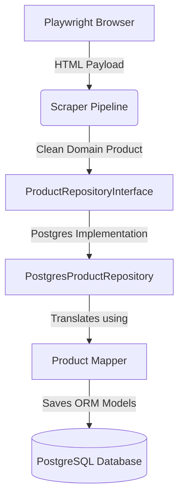
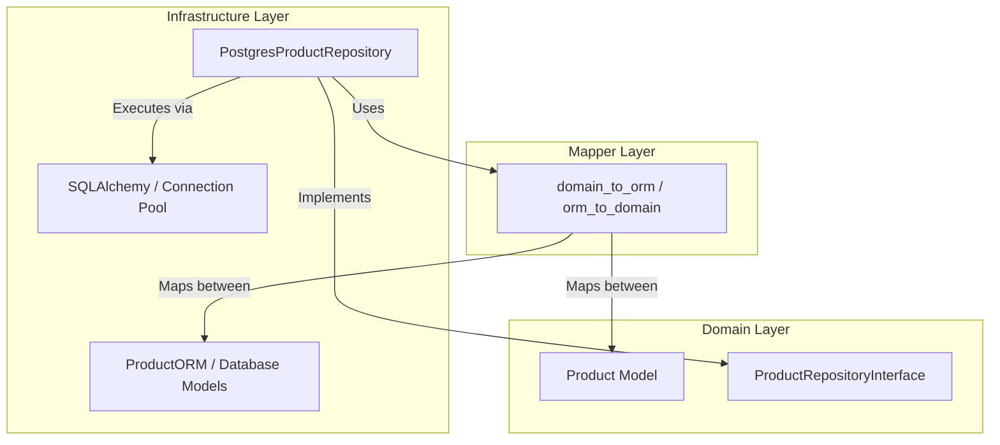
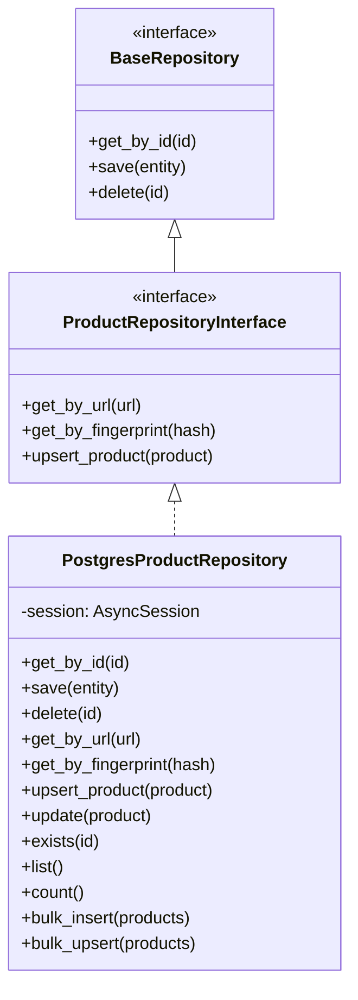
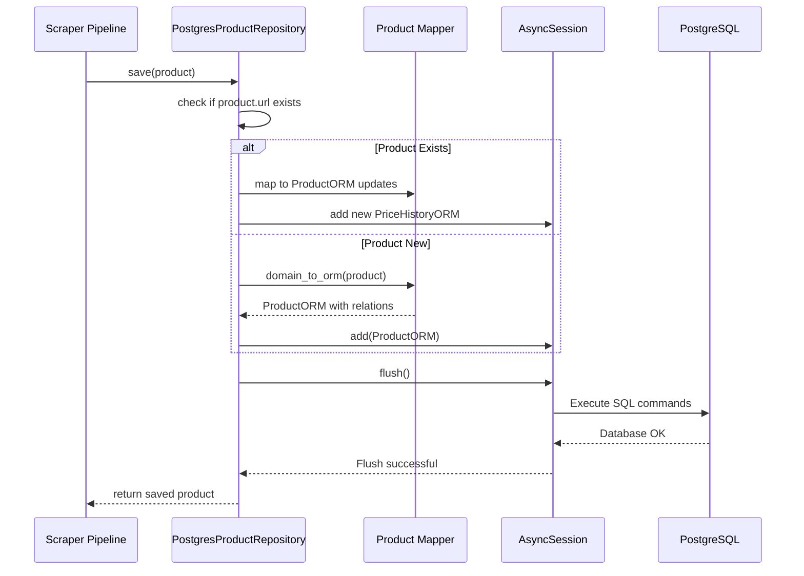

# Phase 5 – Persistent Storage Layer

This guide covers the architecture, design decisions, database models, and transactional lifecycles implemented in Phase 5 of the AI Shopping Assistant project.

---

## Phase 5 Overview

Phase 5 introduces permanent PostgreSQL storage to transition the platform from transient, in-memory execution to a production-grade scraping system.

### Limitations of In-Memory Repositories
* **No Persistence**: Data is lost whenever the crawler process restarts, preventing historical price comparisons or crawling resuming.
* **Memory Exhaustion**: Storing millions of scraped products and price history points in memory leads to process crashes from memory exhaustion.
* **Deduplication Limits**: Cross-run duplicate checking is not possible since the system has no knowledge of past scraped items.

### How PostgreSQL Solves These Problems
* **Permanent Storage**: Scraped products are written to disk, preserving datasets indefinitely.
* **ACID Transactions**: Relational constraints and atomic write cycles prevent database corruption.
* **Indexed Queries**: Rapid indexed lookups check for duplicate URLs or matching SKU codes.

---

## Objectives

* **Permanent Storage**: Retain products, technical specifications, and price histories.
* **Atomic Upserts**: Prevent listing duplicates using canonical URL matching and fingerprint checks.
* **ACID Transactions**: Ensure all writes succeed or roll back completely on failure.
* **Clean Abstraction**: Keep the core domain layer isolated from database drivers or ORM libraries.

---

## Architecture

We implement a decoupled layered architecture using the Repository Pattern and Mapper Layer.

### 1. Overall System Architecture


### 2. Layered Clean Architecture


### 3. Repository Pattern Abstraction


### 4. Database Flow


---

## Folder Structure

The persistent storage layer is located in the following directories:

```
src/
├── database/            # Connection configurations and session factories
│   ├── base.py          # Declarative base class and timestamp mixins
│   ├── config.py        # Database URL config loader
│   ├── connection.py    # Engine pool setup and teardown
│   └── session.py       # AsyncSession transactional context managers
├── orm/                 # SQLAlchemy 2.0 ORM schemas
│   └── models.py        # ProductORM, PriceHistoryORM, ImageORM, SpecificationORM
├── mappers/             # Entity translation interfaces
│   └── product.py       # Domain-to-ORM and ORM-to-Domain mappers
└── repositories/        # Storage engines
    └── postgres/
        └── product.py   # PostgresProductRepository implementation
```

---

## Runtime Flow

The diagram below shows how data moves from web page scraping to database persistence:

```
[Shopping Website]
       │ Scrapes HTML
       ▼
[CrawlWorker]
       │ Extracts
       ▼
[Collector / Parser]
       │ Raw Data
       ▼
[DataQualityAssessor]
       │ Validated JSON
       ▼
[Domain Product Model]
       │ Triggers Save
       ▼
[PostgresProductRepository]
       │ Translates via
       ▼
[Product Mapper]
       │ Generates ORM
       ▼
[SQLAlchemy 2.0 / Session]
       │ Executes SQL
       ▼
[PostgreSQL Database]
```

---

## Database Layer

The database connection layer is implemented in `src/database/`:
* **Base**: The declarative base class `Base` registers all database models, and `TimestampMixin` automatically injects `created_at` and `updated_at` timestamps.
* **Engine**: Singleton `AsyncEngine` manages connection pooling with optimal connection boundaries:
  * `pool_size=10`: Retains 10 persistent connections to reduce login overhead.
  * `max_overflow=20`: Allows up to 20 temporary connections during peak load.
  * `pool_pre_ping=True`: Tests connections before executing queries to prevent connection drops.
* **Session**: Uses `async_sessionmaker` to generate `AsyncSession` contexts.
* **Transactions**: `get_async_session()` context manager manages transactions, executing automatic rollbacks on failure and commits on success.

---

## ORM Layer

SQLAlchemy ORM models in `src/orm/models.py` map database tables to object properties:
* **ProductORM**: Maps the master `products` table.
* **SpecificationORM**: Stores technical specs in a structured `JSONB` column to support polymorphic specs.
* **PriceHistoryORM**: Retains historical price points.
* **ImageORM**: Maps product image URLs.

### Why ORM Models are Separated from Domain Models
* **Dependency Isolation**: Prevents third-party database dependencies (like SQLAlchemy annotations) from bloating the domain core.
* **Lifecycle Separation**: Domain models focus on data validation, whereas ORM models track database session states.

---

## Mapper Layer

The `src/mappers/product.py` module manages object mapping:
* **Responsibilities**:
  * `domain_to_orm`: Maps a domain `Product` entity into database-compatible ORM models.
  * `orm_to_domain`: Converts database records back into clean, validated domain models.
* **Benefits**: Isolates the domain layer from database details, allowing developers to change ORM properties without breaking business logic.

---

## Repository Pattern

* **Repository Interface**: `ProductRepositoryInterface` defines what storage actions are available, without specifying how they are executed.
* **PostgreSQL Repository**: `PostgresProductRepository` implements the interface methods.
* **Dependency Injection**: Services receive `ProductRepositoryInterface` implementations via constructor parameters, enabling developers to swap the memory database for PostgreSQL by changing configuration flags.

---

## Transaction Flow

Transactions follow a standard ACID execution flow:

```
[get_async_session()] (Transaction Context)
        │
        ├─► BEGIN Transaction
        │
        ├─► Save / Update Product ORM
        │
        ├─► Flush to DB (Checks constraints)
        │
        ├─► Commit Transaction (On Success)
        │
        └─► Rollback Transaction (On Exception)
```

---

## Upsert Strategy

To prevent duplicate products, the repository checks for existing records prior to inserting:
1. **URL Match**: Checks if the canonical page URL is already present in the database.
2. **Fingerprint Match**: Checks if the duplicate fingerprint hash matches existing records.
3. **Execution**: If a match is found, the repository updates the product's mutable fields and appends a new price entry; otherwise, it inserts a new product.

### Why the URL is Used as a Unique Key
Web page canonical URLs are stable, unique identifiers. Using them as unique keys prevents multiple crawler workers from registering duplicate listings for the same product.

---

## Testing

The integration tests in `tests/integration/test_postgres_repository.py` verify database functionality:
* **CRUD Tests**: Verifies save, update, delete, and lookup operations.
* **Exists Checks**: Tests `exists()`, `find_by_url()`, and `find_by_id()` methods.
* **Bulk Operations**: Tests `bulk_insert()` and `bulk_upsert()`.
* **Rollback and Isolation**: Verifies that transactions roll back on error.

---

## Scalability Notes

When scaling to **millions of products**, consider the following optimizations:
* **Native UUIDs**: Migrate `UUID(as_uuid=False)` string columns to native PostgreSQL `UUID` types to save storage space and speed up index lookups.
* **Composite Indexes**: Add a composite index on `(product_id, timestamp)` in the `price_history` table to improve sorting performance.
* **Batch Upserts**: Refactor the sequential loop in `bulk_upsert()` to execute batch queries and bulk updates.
* **Table Partitioning**: Partition the `price_history` table by date ranges to prevent performance degradation as the dataset grows.

---

## Summary

Phase 5 implements database persistence for the AI Shopping Assistant platform. By introducing SQLAlchemy ORM mapping, repositories, mappers, and transaction controls, the system can securely store and query scraped products, creating a foundation for downstream AI matching and analysis features.
