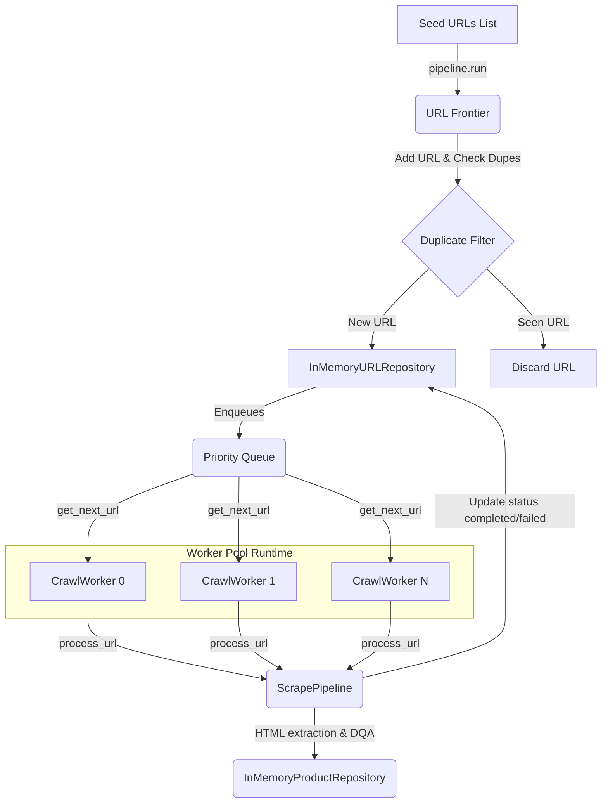

# Phase 3 – Crawling Infrastructure

This engineering document provides an in-depth architectural and operational guide for the Phase 3 crawling infrastructure implemented in the AI Shopping Assistant Scraping Platform.

---

## 1. Overview

Phase 3 builds upon the modular Playwright-based acquisition and parsing runtime established in Phase 2, scaling it from single-URL execution into a fully concurrent, prioritized multi-site crawling platform. This phase introduces an asynchronous scheduling layer, a duplicate-preventing URL Frontier, concurrent worker routines, and database-abstracted repositories to facilitate high-throughput crawler operations.

---

## 2. Objectives

As the scraping platform transitions to multi-site ingestion, a structured crawling infrastructure becomes essential to resolve several key engineering challenges:
* **Scalability**: Decoupling seed list submission from worker processing allows the system to scale page execution throughput horizontally.
* **Concurrent Crawling**: Fetching multiple pages concurrently utilizes network resources and handles heavy listing-discovery crawls efficiently.
* **Multi-Site Support**: Standardizing the execution loop via registry plugins allows the crawler to manage Amazon, BestBuy, and future site crawlers under a single worker definition.
* **Modular Architecture**: Restricting state updates, prioritization math, and page extraction to separate components prevents tight coupling and supports pluggable storage backends (e.g., in-memory mock vs. PostgreSQL).

---

## 3. Architecture

The crawling infrastructure orchestrates seed lists through prioritizers, workers, and extraction pipelines to database targets.



---

## 4. Folder Structure

```
src/
├── frontier/
│   ├── queue.py         # PriorityQueue implementing FIFO sorting & dupe filters
│   └── frontier.py      # URLFrontier managing states, retries, and preloading
├── workers/
│   ├── worker.py        # CrawlWorker processing tasks & executing lifecycle hooks
│   └── pool.py          # WorkerPool controlling workers & aggregating metrics
├── repositories/
│   ├── product.py       # InMemoryProductRepository supporting CRUD operations
│   └── url.py           # InMemoryURLRepository tracking queue and retry states
└── pipeline/
    └── crawl_pipeline.py# CrawlPipeline orchestrating runs and termination monitors
```

---

## 5. URL Frontier

The `URLFrontier` acts as the queue control center, coordinating how URLs are stored, updated, and retried:
* **Duplicate Prevention**: Prior to enqueuing, URLs are matched against the repository. Existing records are skipped, preventing infinite loops on circular site structures.
* **Crawl States**: Updates state variables within the repository (`pending`, `in_progress`, `completed`, `failed`, `retry`) to reflect active execution steps.
* **Retry Management**: Increments attempts on page drops. If the count remains below the `max_attempts` threshold, status is set to `retry` and the item is re-queued. Otherwise, it is marked as `failed`.
* **State Recovery**: Supports preloading pending or retry tasks from the database into the queue during startup to recover checkpoints after interruptions.

---

## 6. Priority Queue

The `PriorityQueue` coordinates access to pending crawl tasks:
* **Priority Ordering**: Sorts URLs based on `PriorityEnum` levels (High, Medium, Low) using a mapped integer weight (`HIGH=0`, `MEDIUM=1`, `LOW=2`).
* **FIFO Guarantee**: Enforces First-In-First-Out ordering for matching priority levels by pairing priority scores with monotonic addition timestamps in comparisons.
* **Duplicate URL Prevention**: Maintains a synchronized lookup set of active queue members to reject duplicate insert commands.
* **Concurrency Safety**: Wraps operations in an `asyncio.Lock` to guarantee atomic queue status modifications across concurrent workers.

---

## 7. Worker Pool

The `WorkerPool` acts as the manager for the concurrency layer:
* **Worker Lifecycle**: Programmatically instantiates, starts, and references workers based on configured concurrency parameters.
* **Worker Coordination**: Distributes tasks by referencing a single shared `URLFrontier` instance.
* **Graceful Shutdown**: Stops the execution loops of all active workers concurrently using `asyncio.gather(*stop_tasks, return_exceptions=True)` to prevent orphaned routines.

---

## 8. Crawl Worker

The `CrawlWorker` executes single-page crawl tasks:
* **Pulling URLs**: Awaits incoming tasks from the shared frontier priority queue.
* **Executing ScrapePipeline**: Runs the complete multi-stage pipeline, including network fetching, BS4 parsing, normalization, DQA checks, duplicate detection, and repository updates.
* **Status Updates**: Transitions task status to `in_progress` during execution, marking it as `completed` or `failed` upon resolution.
* **Pipeline Hooks**: Supports async `before_request`, `after_request`, and `on_save` callback hooks to dynamically track runtime events.

---

## 9. Crawl Pipeline

The `CrawlPipeline` orchestrates the crawl lifecycle:
* **Scheduling**: Enqueues input seed lists into the frontier and triggers preloading sweeps.
* **Monitoring**: Polls queue status and active worker states at configurable intervals.
* **Termination Detection**: Declares run completion when the priority queue is empty, no URLs are pending in the repository, and active workers return to idle.
* **Timeouts**: Terminates worker pools and raises warnings if active operations exceed configured timeouts.

---

## 10. Repository Layer

* **InMemoryProductRepository**: Implements `ProductRepositoryInterface` with deep-copied dictionary maps, supporting atomic price merges, SKU lookups, and full database list views.
* **InMemoryURLRepository**: Implements `DiscoveredURLRepositoryInterface` to track URL execution states, update timestamps, and retrieve pending tasks.
* **Repository Pattern Advantages**: Decoupling the database layout from the pipeline core allows you to swap mock implementations for SQLAlchemy or Document DBs without editing worker logic.

---

## 11. Configuration

The `CrawlerSettings` class manages parameters for crawl execution:
* `num_workers` (int): Number of concurrent execution daemons.
* `check_interval` (float): Frequency of queue checking polls.
* `timeout_seconds` (float | None): Maximum execution timeout limit.

---

## 12. Logging

We utilize structured logging via `structlog` to track crawl jobs:
* **Correlation Context**: Worker operations are tagged with `worker_id`, `site_id`, and `run_id` context fields.
* **Scrape Records**: Captures extraction throughput, network codes, rate limit delays, and retry paths.

---

## 13. Metrics

Scraping metrics are tracked across the following categories:
* **processed**: Total crawl attempts initiated.
* **success**: Total pages successfully parsed, validated, and saved.
* **failed**: Total pages that exceeded retry limits or failed quality thresholds.
* **retries**: Total retries triggered by transient network failures.

---

## 14. Error Handling

* **Retries**: Retries transient network failures by re-enqueuing URLs into the priority queue with updated attempts.
* **Failures**: Moves URLs to the `failed` state and logs error traces if retry limits are exceeded or DQA checks fail.
* **Graceful Teardown**: Ensures worker pools release Playwright resource allocations under unexpected exit conditions.

---

## 15. Thread Safety

* **Asyncio Queue**: Leverages thread-safe asyncio primitives for async execution.
* **Concurrency Locks**: Uses `asyncio.Lock` to ensure atomic updates to duplicate tracking sets.

---

## 16. Unit Tests

* **`test_repositories.py`**: Verifies CRUD operations, deep-copy safety, SKU matching, and state changes.
* **`test_frontier.py`**: Validates FIFO priority sorting, duplicate checking, preloading, and retry cycles.
* **`test_worker_pool.py`**: Exercises mock worker runs, pipeline hooks, concurrent pool metrics, and shutdowns.

---

## 17. Code Quality

* **Ruff**: Enforces coding guidelines, import orders, and line lengths.
* **MyPy**: Enforces strict type checking.
* **Pytest**: Provides automated test validation.
* **Architecture Principles**: Adheres to SOLID, Dependency Injection, and Clean Architecture patterns.

---

## 18. Design Decisions

* **Wrapper Queue**: We chose to wrap `asyncio.PriorityQueue` rather than subclassing it to decouple our custom duplicate checks and lock logic from standard library internals.
* **Deep Copying**: Memory repositories execute deep copies on inputs/outputs to prevent mutation side-effects across concurrent worker tasks.

---

## 19. Challenges Faced & Resolved

### Metrics Synchronization Issue
* *Challenge*: Stopping the worker pool cleared active worker lists (`self.workers = []`), discarding accumulated scrape metrics before they could be read.
* *Solution*: Implemented `self._accumulated_metrics` in `WorkerPool` to aggregate worker metrics before they are cleared during pool teardown.

---

## 20. Lessons Learned

* **State Isolation**: Isolating state-mutating steps behind async locks prevents race conditions in concurrent crawl environments.
* **Decoupled Architecture**: Restricting components to clean interfaces makes it easy to write mock implementations and run unit tests.

---

## 21. Future Improvements

Future iterations will extend the scraping runtime with:
* **Redis-backed queues**: Support distributed queue management across multiple hosts.
* **PostgreSQL repositories**: Persist queue states and product records in relational database tables.
* **Distributed workers**: Scale worker daemons as containerized microservices.
* **Autoscaling**: Scale worker pools dynamically based on queue size and target site rate limits.
* **Kubernetes deployment**: Deploy workers inside cluster environments.

---

## 22. Phase Summary

Phase 3 builds the crawling infrastructure for the AI Shopping Assistant platform. By introducing a priority-aware URL Frontier, concurrent worker pools, in-memory repository abstractions, and robust error recovery, the crawler is well-positioned for scaling into a high-performance distributed architecture.
