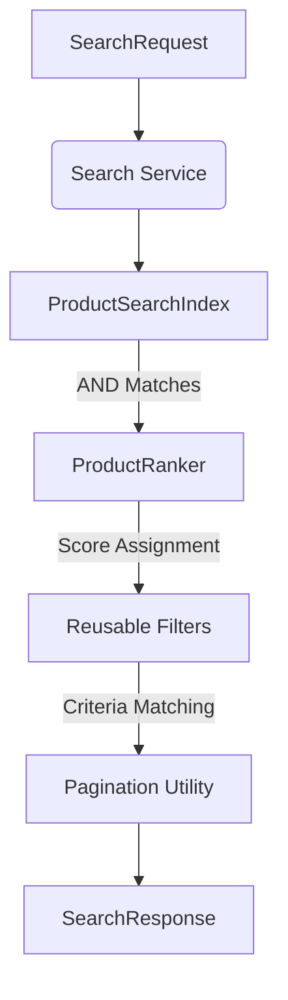
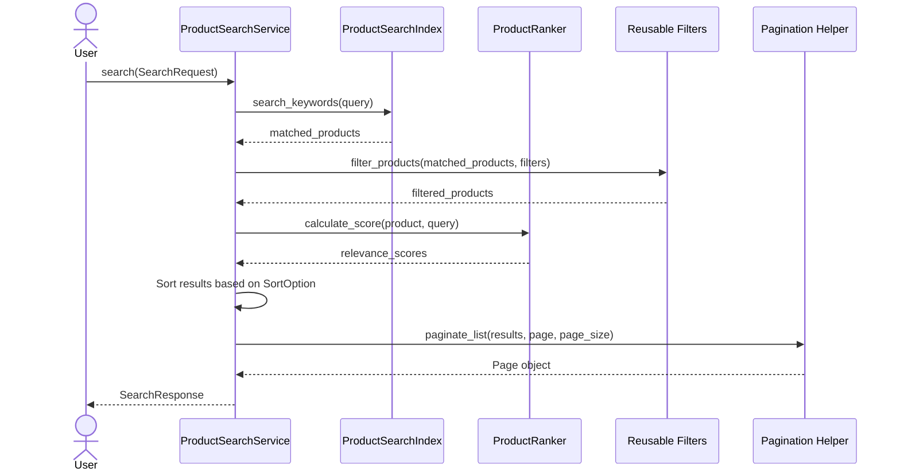

# Phase 4 – Search & Ranking Infrastructure

This documentation provides an architectural and operational guide for the Phase 4 Search and Ranking Layer implemented in the AI Shopping Assistant platform.

---

## Phase 4 Overview

The Search and Ranking Layer provides a high-performance search engine to query, score, filter, and paginate scraped products. 

### Why a Decoupled Search Layer is Required
Directly querying database repositories (like SQL `LIKE` queries) introduces significant scalability bottlenecks:
* **Inefficient Table Scans**: Relational database queries scanning text fields require full table scans ($O(N)$ complexity) that degrade under high concurrent read loads.
* **Lack of Term Relevance**: Standard database queries return binary matches (yes/no) without sorting results by keyword matching frequency, field significance, or availability status.
* **Tight Coupling**: Binding search parameters to database queries restricts the platform's ability to migrate to specialized indexing tools (e.g., Elasticsearch, OpenSearch) or use semantic vector search spaces in the future.

By introducing an in-memory Inverted Index, a rule-based Ranking Engine, and isolated filter/pagination utilities, the Search Layer decouples product queries from storage engines while achieving sub-millisecond retrieval speeds.

---

## Goals

During Phase 4, the following milestones were completed:
* **Product Search**: High-performance, case-insensitive keyword search matching title, brand, and category fields.
* **Request and Response Models**: Pydantic v2 schemas validating pagination parameters, price range bounds, and sorting choices.
* **In-Memory Search Index**: An inverted index supporting atomic keyword additions, deletions, updates, and fast intersection lookups.
* **Ranking Engine**: Rule-based scoring with exact title match boosts, partial token matches, and product availability boosts.
* **Filtering Utilities**: Reusable criteria matching for brands, prices, categories, stores, and stock status.
* **Pagination Helper**: Page container slicing and metadata calculations.
* **Search Service Orchestration**: Single-point service utilizing repository synchronization, search indexing, ranking, filtering, and pagination.

---

## Architecture

The search service coordinates individual index, scoring, and pagination modules:



### Component Responsibilities

| Component | Responsibility |
| :--- | :--- |
| **Search Service** | Coordinates operations by syncing repository records, querying the index, and formatting responses. |
| **Search Index** | Houses keyword-to-product mappings, tokenizes inputs, and retrieves target IDs. |
| **Ranking Engine** | Calculates relevance scores using term weighting and availability boosts. |
| **Filters** | Sanitizes and evaluates candidate products against active search filters. |
| **Pagination** | Slices sorted result lists and computes page bounds. |

---

## Folder Structure

All search and ranking components are housed in the `src/search/` directory:

```
src/
└── search/
    ├── __init__.py      # Package declaration
    ├── models.py        # Pydantic schemas (SearchRequest, SearchResponse, etc.)
    ├── index.py         # ProductSearchIndex inverted index implementation
    ├── ranking.py       # ProductRanker scoring engine
    ├── filters.py       # Reusable filter utilities
    ├── pagination.py    # List-slicing and metadata helpers
    └── service.py       # ProductSearchService orchestration class
```

---

## Search Flow

The sequence diagram below shows the search request lifecycle:



---

## Search Models

### Models Implemented
* `SortOption` (Enum): Supports sorting by `relevance`, `price_low_to_high`, `price_high_to_low`, and `newest`.
* `SearchFilters`: Tracks optional boundaries for brand lists, price ranges, categories, store IDs, and stock availability.
* `SearchRequest`: Contains raw query inputs, pagination configurations, filters, and sort options.
* `SearchResult`: Wraps a matching `Product` along with its relevance score and matched fields list.
* `SearchResponse`: Standard response payload containing pagination metadata and lists of `SearchResult` objects.

### JSON Schema Examples

#### SearchRequest Payload
```json
{
  "query": "Dell XPS Laptop",
  "page": 1,
  "page_size": 2,
  "filters": {
    "brand": ["Dell"],
    "min_price": 800.00,
    "max_price": 1200.00,
    "category": "laptop",
    "availability": true
  },
  "sort_by": "relevance"
}
```

#### SearchResponse Payload
```json
{
  "total_results": 1,
  "page": 1,
  "page_size": 2,
  "total_pages": 1,
  "has_next": false,
  "has_previous": false,
  "results": [
    {
      "product": {
        "id": "prod_123",
        "site_id": "bestbuy_us",
        "url": "https://www.bestbuy.com/site/dell/1.p",
        "sku": "1",
        "title": "Dell XPS 13 Laptop",
        "brand": "Dell",
        "model_name": "XPS 13",
        "category": "laptop",
        "current_price": 999.99,
        "original_price": 999.99,
        "currency": "USD",
        "is_in_stock": true
      },
      "score": 16.2,
      "matched_fields": ["title", "brand"]
    }
  ]
}
```

---

## Search Index

The `ProductSearchIndex` maps text keywords to corresponding matching Product ID keys.

* **Inverted Index Map**: Maps unique lowercase alphanumeric keyword tokens to a `set` of matching product IDs (`dict[str, set[str]]`).
* **Tokenization**: Uses a regular expression scanner (`\w+`) to clean text, strip punctuation, and split strings into lowercase token sets.
* **Index Updates**: `update_product()` retrieves the product's previously indexed token list, removes the product ID from those buckets, deletes empty token sets, and indexes the new fields.
* **Product Removal**: Deletes product records and discards the corresponding product ID from all active token sets.
* **Search Lookup**: Intersects token sets using the `intersection_update` method, executing an efficient `AND` search for queries containing multiple terms.

```python
# Term Intersection Logic
matched_ids = set()
first = True
for token in query_tokens:
    token_matches = self._index.get(token, set())
    if first:
        matched_ids = set(token_matches)
        first = False
    else:
        matched_ids.intersection_update(token_matches)
```

---

## Ranking Engine

The `ProductRanker` calculates a relevance score for matched products using keyword relevance and product availability.

### Scoring Calculations

$$\text{Relevance Score} = (\text{Title Matches} + \text{Brand Matches} + \text{Category Matches} + \text{Exact Title Boost}) \times \text{Availability Multiplier}$$

* **Exact Title Match Boost**: Adds a configuration-defined boost (default: `+5.0` points) if the full query matches the product title (case-insensitive).
* **Field Token Weighting**: 
  * Title match weight (default: `+2.0` points per matching token).
  * Brand match weight (default: `+1.5` points per matching token).
  * Category match weight (default: `+1.0` point per matching token).
* **Availability Boost**: Applies a multiplicative boost (default: `x1.2`) to the final score if the product is currently in stock.

---

## Filtering

The `filters.py` module evaluates candidate products against filter criteria:
* **Brand Matching**: Ensures the product's brand is present in the allowed brand list.
* **Price Range Matching**: Verifies the product's price falls between `min_price` and `max_price`.
* **Category Matching**: Validates the product's category value matches the target category enum value.
* **Availability Matching**: Filters products based on whether they are in stock.
* **Store Matching**: Restricts results to specific site identifiers (`site_id`).

---

## Pagination

The `pagination.py` module slices matching results to return a paginated response payload.

### Pagination Formulas
* **Total Pages**: 
  $$\text{total\_pages} = \max\left(0, \left\lceil \frac{\text{total\_results}}{\text{page\_size}} \right\rceil\right)$$
* **Index Slicing**:
  $$\text{start\_index} = (\text{page} - 1) \times \text{page\_size}$$
  $$\text{end\_index} = \text{start\_index} + \text{page\_size}$$
* **Previous Page Flag**: `page > 1`
* **Next Page Flag**: `page < total_pages`

---

## Search Service

The `ProductSearchService` manages search queries and synchronizes index changes:
1. **Syncing Indexes**: Loads products from the database repository using `list_products()` and rebuilds the inverted index.
2. **Executing Queries**: Searches the inverted index, filters matching results, scores matches using the ranking engine, sorts results by `SortOption`, and slices the results to return a paginated `SearchResponse`.

---

## Design Decisions

* **Clean Architecture**: Decouples search interfaces from database implementations, ensuring database migrations do not affect keyword logic.
* **SOLID Principles**: Single-responsibility components keep filtering, scoring, indexing, and slicing utilities modular.
* **Dependency Injection**: The search service accepts repository interfaces, indexes, and rankers via constructor injection.

---

## Testing

The following unit test modules verify Phase 4 functionality:

* **`test_search_models.py`**: Verifies Pydantic validation rules, pagination bounds, and price range constraints.
* **`test_search_index.py`**: Validates addition, deletion, update, and intersection lookup logic.
* **`test_ranking.py`**: Verifies exact matching boosts, token matching, and stock multipliers.
* **`test_search_service.py`**: Verifies repository syncing, search filtering, and paginated response payloads.
* **`test_filters.py`**: Evaluates brand, price, category, store, and availability matching logic.
* **`test_pagination.py`**: Verifies slice indexing, page limits, and out-of-bounds page values.

---

## Future Improvements

* **PostgreSQL-backed Persistence**: Migrate in-memory indexes to database-supported text search indexes (e.g., GIN index with `tsvector`).
* **Elasticsearch / OpenSearch**: Replace in-memory index structures with production-grade search clusters to support fuzzy matching, term highlighting, and synonym matching.
* **Semantic Vector Search**: Integrate embedding models and vector databases (e.g., pgvector, Qdrant) to support natural language queries.
* **AI-driven Recommendations**: Combine user interest signals and historical click rates into search rankings using collaborative filtering models.

---

## Key Takeaways

Phase 4 introduces keyword search capabilities to the AI Shopping Assistant platform. By implementing decoupled search, ranking, filtering, and pagination components, the platform can support fast product queries, relevant search rankings, and pagination logic while remaining flexible for future backend updates.
