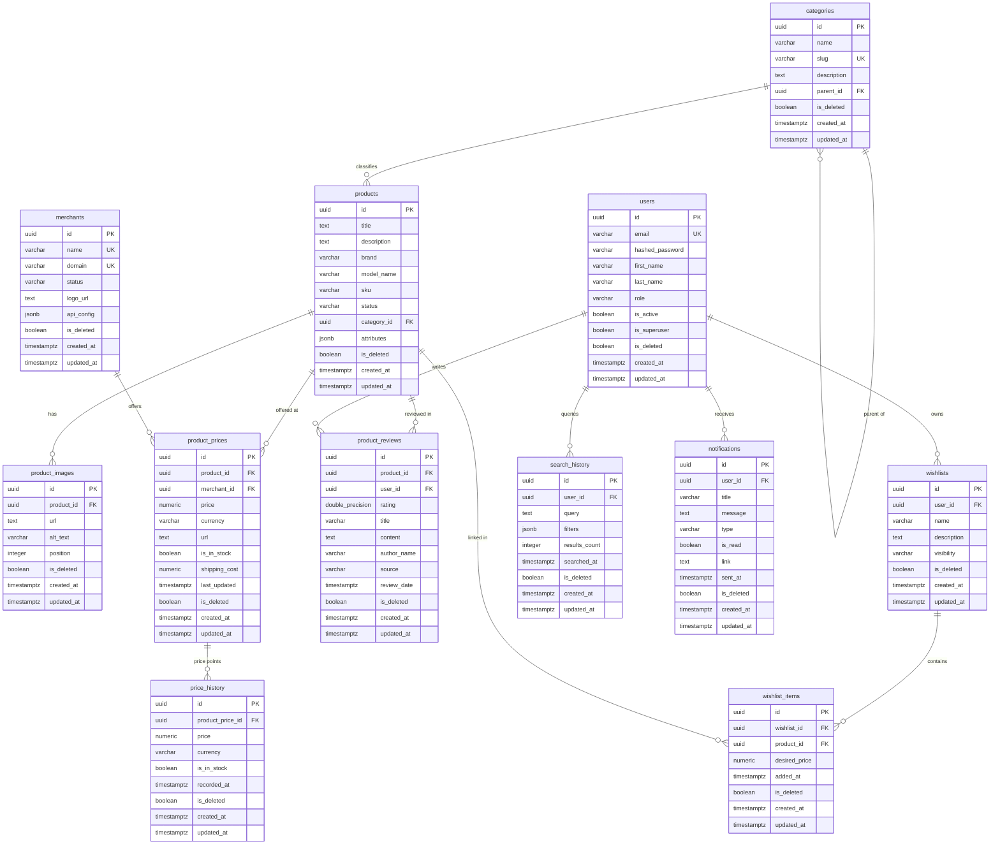

# Entity Relationship Diagram: Phase 6
## AI Shopping Assistant Backend

This document contains the Entity Relationship Diagram (ERD) detailing table columns, primary/foreign keys, and cardinalities.

---

## 1. Mermaid ER Diagram

---

## 2. Cardinality Summaries

* **Category Tree**: One parent category has Zero-to-Many child categories (1:N, self-referential).
* **Category to Products**: One category classifies Zero-to-Many products (1:N). If deleted, product relationships are nullified.
* **Product to Images**: One product has Zero-to-Many images (1:N, CASCADE delete).
* **Product Price offers**: One product has Zero-to-Many price listings across merchants (1:N).
* **Merchant prices**: One merchant offers Zero-to-Many price listings (1:N).
* **Price listing history**: One price listing has Zero-to-Many historical logs (1:N, CASCADE).
* **Product Reviews**: One product has Zero-to-Many reviews (1:N). One user writes Zero-to-Many reviews (1:N, SET NULL on user deletion).
* **Wishlist Items M:N Link**: 
  - One user has Zero-to-Many wishlists (1:N).
  - One wishlist contains Zero-to-Many wishlist items (1:N, CASCADE).
  - One product links to Zero-to-Many wishlist items (1:N, CASCADE).
* **User Search & Alerts**: One user has Zero-to-Many search logs and receives Zero-to-Many notifications (1:N, CASCADE).
